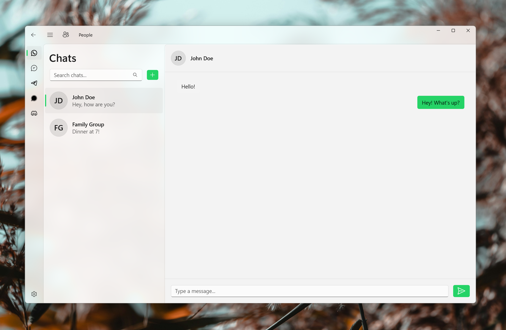

# People App

A modern, unified messaging application built for Windows 11. It brings together conversations from various platforms into a single, cohesive, and beautiful native experience. Built using WinUI 3, Windows App SDK, C#, and .NET 10, the application leverages the Fluent Design System to provide fluid animations, dynamic theming, and responsive layouts.

## Features

* Unified Messaging: Aggregate messages from multiple platforms into one central hub.
* Native Windows 11 Experience: Implements Fluent Design principles including Mica backdrops, rounded corners, and native typography.
* Responsive Master-Detail Layout: Seamlessly adapts to wide desktop monitors and narrow window sizes with dynamic navigation and page transitions.
* Accessibility First: Full support for keyboard navigation, screen readers via UI Automation, and high contrast themes.
* Quick Reply Flyout: Access your recent conversations quickly from the system tray without opening the full application window.
* Customizable Appearance: Choose between Light, Dark, or System themes, and configure transparency effects.

## Roadmap

* Version 1.0 (Current): WhatsApp integration, core UI framework, system tray integration, and settings management.
* Version 2.0: SMS integration via Android Companion, Telegram and Signal support, and global keyboard shortcuts.
* Future Versions: Support for Discord and Matrix protocols, advanced message filtering, and offline caching improvements.

## Building the Project

1. Ensure you have Visual Studio 2022 installed with the Windows application development workload.
2. Verify that the .NET 10 SDK and the Windows App SDK are installed.
3. Clone the repository and open the solution file.
4. Set the People project as the startup project.
5. Build and run the project targeting x64 or ARM64.
